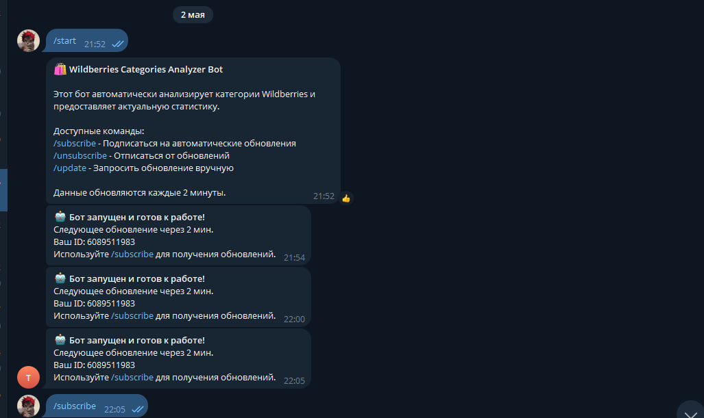
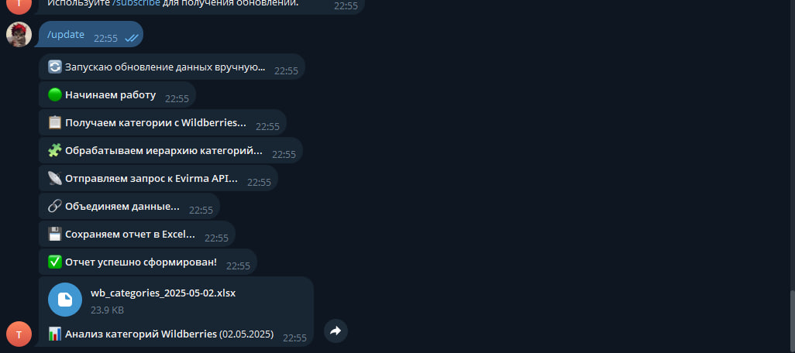

# 🛍️ Wildberries Categories Analyzer Bot

Этот Telegram-бот автоматически анализирует категории Wildberries и ежедневно отправляет отчёт в формате Excel с аналитикой, обогащённой SEO-данными из внешнего API (например, Evirma).

## 📦 Возможности

* Автоматическая отправка Excel-отчёта в 09:00 и 15:00 (по МСК)
* Команды для подписки, отписки и ручного получения отчёта
* Поддержка нескольких администраторов
* Интеграция с внешним API для анализа ключевых слов
* Удобное логирование

## 📸 Скриншот




---

## 🚀 Быстрый старт

### 1. Установите зависимости

Рекомендуется использовать виртуальное окружение:

```bash
python -m venv venv
source venv/bin/activate  # или venv\Scripts\activate на Windows
```

Установка зависимостей:

```bash
pip install -r requirements.txt
```

### 2. Настройте переменные окружения

Создайте файл `.env` в корне проекта и укажите следующее:

```env
TELEGRAM_BOT_TOKEN=your_bot_token_here
ADMIN_ID=123456789,987654321
```

* `TELEGRAM_BOT_TOKEN`: токен вашего Telegram-бота от BotFather
* `ADMIN_ID`: ID одного или нескольких Telegram-пользователей (через запятую), которым будет доступен бот

Узнать свой Telegram ID можно через бота [@userinfobot](https://t.me/userinfobot)

### 4. Запуск бота

```bash
python main.py
```

Бот запустится, назначит задания по расписанию и начнёт работу. Администраторы получат уведомление о запуске.

---

## 🤖 Команды бота (доступны только администраторам)

| Команда        | Описание                                       |
| -------------- | ---------------------------------------------- |
| `/start`       | Показать описание и инструкции                 |
| `/subscribe`   | Подписаться на автоматическую рассылку отчётов |
| `/unsubscribe` | Отписаться от автоматических уведомлений       |
| `/update`      | Сгенерировать отчёт вручную и получить файл    |

---

## 📅 Расписание

Бот автоматически отправляет обновлённый отчёт:

* Утром — **09:00 МСК**
* Днём — **15:00 МСК**

Формат отчёта — `.xlsx`, включает иерархию категорий Wildberries и SEO-аналитику по ним.

---

## 🧩 Структура проекта

```
.
├── main.py                # Основной файл запуска бота
├── wb_categories_parser.py # Модуль обработки и анализа категорий
├── requirements.txt       # Зависимости проекта
├── .env                   # (добавьте вручную) Секреты и конфигурация
└── README.md              # Документация
```

---

## 🔐 Безопасность

* Бот не отвечает на сообщения от неадминистраторов
* Все ключи берутся из `.env` и не хранятся в коде

---

## 🛠️ Зависимости

* `aiogram`
* `APScheduler`
* `aiohttp`
* `python-dotenv`
* `pandas`
* `openpyxl`


## 📞 Обратная связь

Напишите в телеграмме @NurjahonErgashevMe или кворк https://kwork.ru/user/nurjahonergashevme
